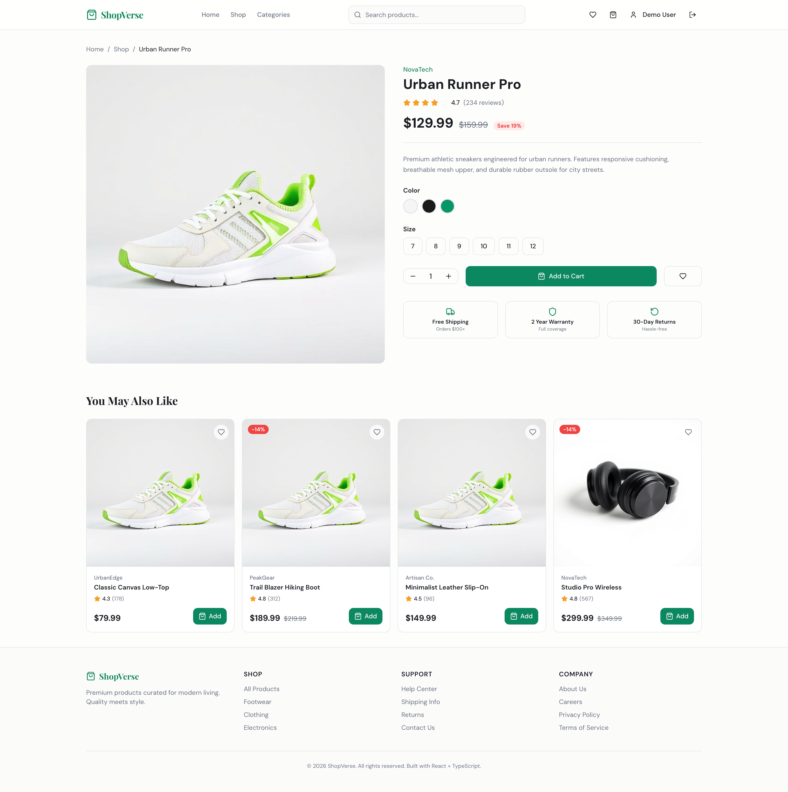
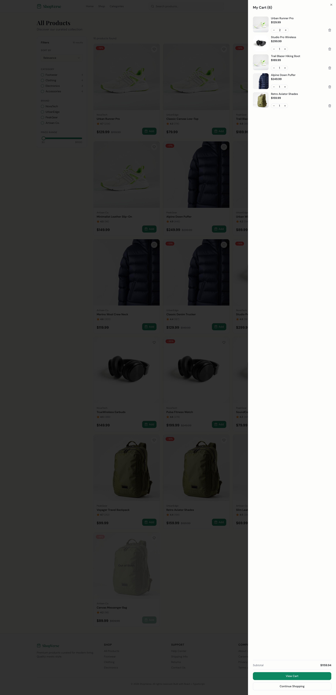
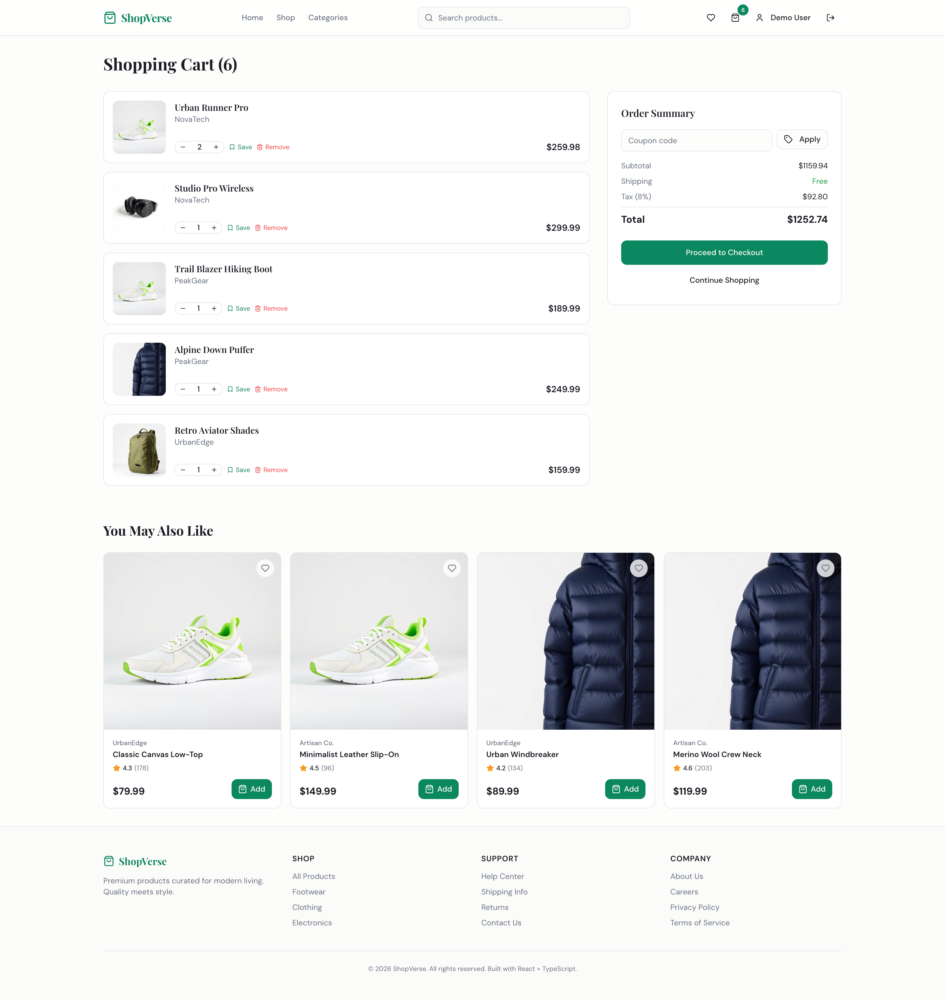
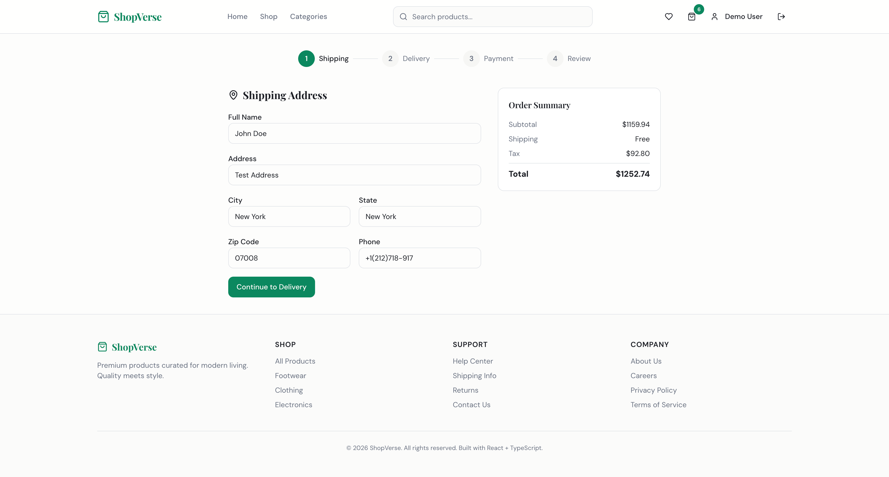
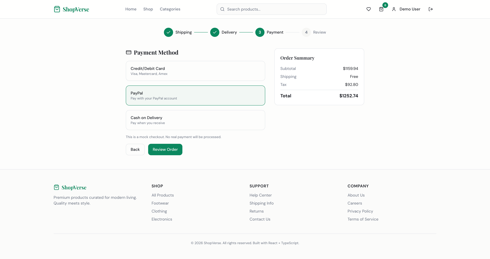
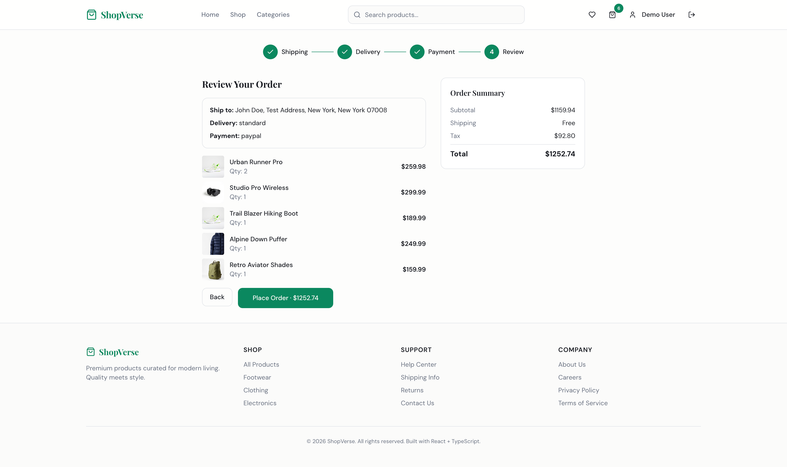
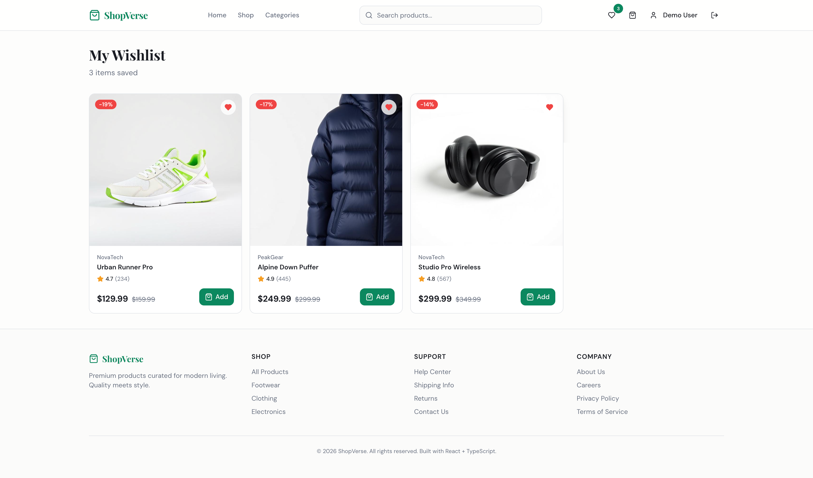
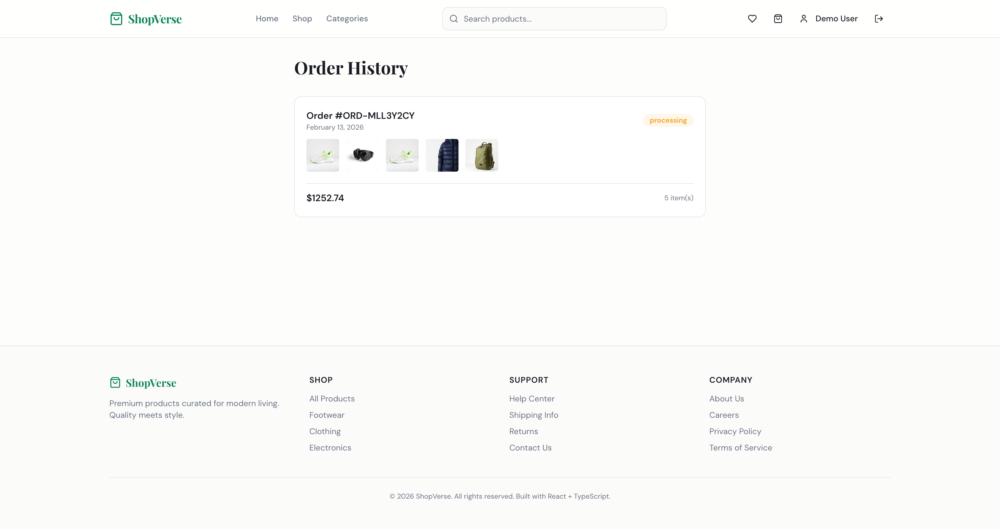

# 🛒 ShopVerse — Modern E-Commerce Platform

A feature-rich, production-ready e-commerce web application built with **React**, **TypeScript**, **Tailwind CSS**, and **Vite**. Designed to demonstrate clean architecture, modular design patterns, and a polished user experience.

---

## 📸 Screenshots

> Add your own screenshots in the sections below.

| Page                | Screenshot                                                | Link to Screenshot |
| ------------------- | --------------------------------------------------------- | ------------------ |
| **Home Page**       |                   |                    |
| **Product Listing** |      |                    |
| **Product Detail**  |        |                    |
| **Shopping Cart**   |          |                    |
|                     |         |                    |
| **Checkout Flow**   |  |
|                     |  |
|                     |  |
|                     |  |
| **Wishlist**        |                    |                    |
| **Order History**   |          |                    |
| **Signup**          |                        |                    |

---

## ✨ Features

### 🏠 Home Page

- **Shop by Category** grid with hover animations
- **Featured Products** and **Trending Now** sections
- Newsletter subscription section

### 🛍️ Product Catalog

- Advanced filtering: search, category, brand, price range, size, rating
- Sort by: relevance, price (low/high), rating, newest
- Responsive grid layout (2-col mobile → 4-col desktop)

### 📦 Product Detail

- Image gallery with multiple views
- Add to Cart / Add to Wishlist actions
- Price with original/discounted display

### 🛒 Shopping Cart

- Add, remove, and update item quantities
- **Coupon system** with 4 built-in codes:
  - `SAVE10` — 10% off
  - `SAVE20` — 20% off (min $200)
  - `FLAT15` — $15 off (min $75)
  - `FREESHIP` — Free shipping
- Order summary (subtotal, discount, shipping, total)
- Free shipping on orders over $100

### 💳 Multi-Step Checkout

- **Step 1**: Shipping address form with validation
- **Step 2**: Delivery method selection (Standard / Express / Overnight)
- **Step 3**: Payment method selection (Card / PayPal / COD)
- **Step 4**: Order review with full summary

### ❤️ Wishlist

- Save/remove favorite products
- Quick add-to-cart from wishlist

### 📋 Order History

- Order statuses: Processing → Shipped → Delivered

### 🔐 Authentication (Mock)

- Login / Signup pages
- Protected checkout route
- Auth state managed via Context API

### 🎛️ Feature Flags

Production-ready feature toggle system:

```typescript
enableWishlist | enableCoupons | enableSaveForLater;
enableRecommendations | enableSkeletonLoading;
enableRetryLogic | enableOrderHistory;
```

---

### Key Patterns

- **State Management**: Context API + `useReducer` for complex cart logic with derived computations (`useMemo`)
- **Performance**: `useCallback` for memoized handlers, lazy computed totals
- **Type Safety**: Full TypeScript coverage with strict interfaces
- **Component Design**: Small, focused components with shadcn/ui primitives
- **Animations**: Framer Motion for page transitions and micro-interactions

---

## 🚀 Getting Started

### Prerequisites

- **Node.js** ≥ 18 — [install with nvm](https://github.com/nvm-sh/nvm#installing-and-updating)

### Installation

```bash
# Clone the repository
git clone <YOUR_GIT_URL>
cd <YOUR_PROJECT_NAME>

# Install dependencies
npm install

# Start development server
npm run dev
```

The app will be available at `http://localhost:5173`

---

## 📱 Responsive Design

Fully responsive across all breakpoints:

- **Mobile** (320px+): 2-column product grid, stacked layouts
- **Tablet** (768px+): 3-column grids, side-by-side sections
- **Desktop** (1024px+): 4-column grids, sidebar layouts, sticky elements
